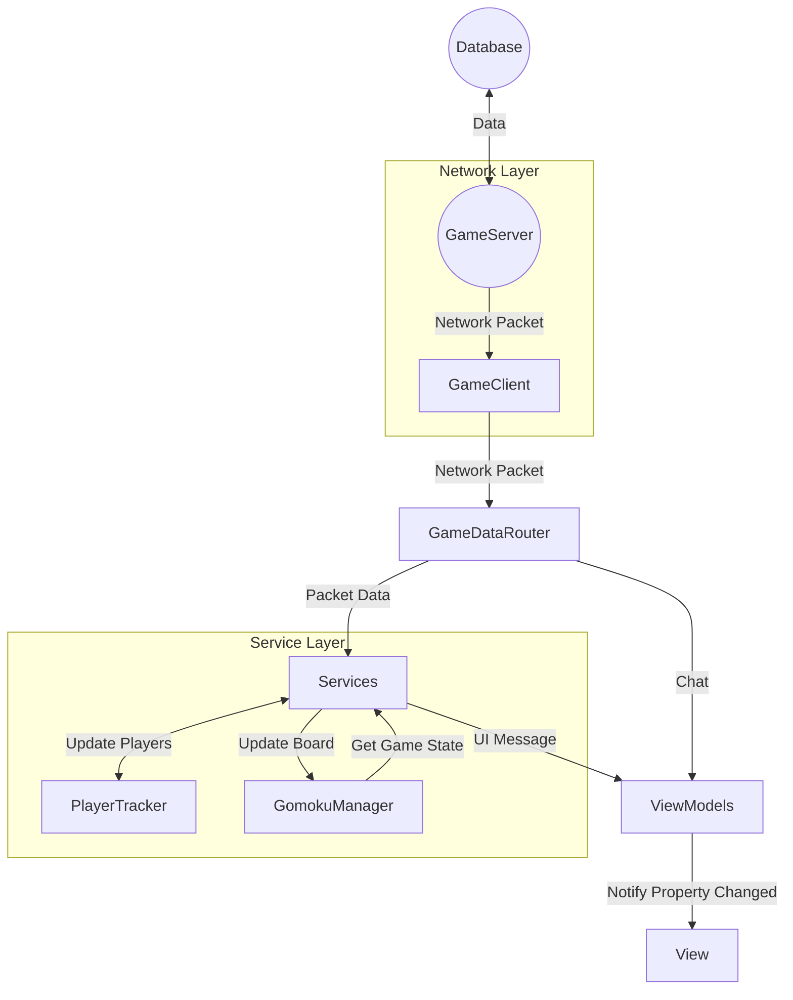
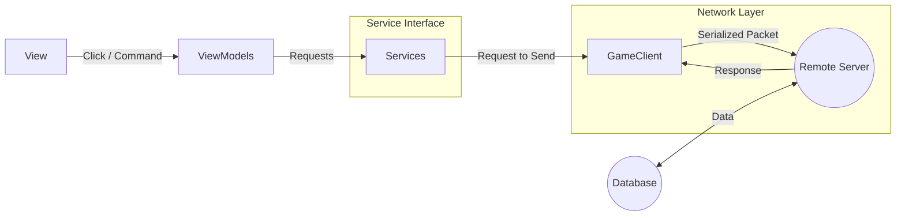

# 네트워크 통신 오목 게임
- Java -> C# WPF 마이그레이션
# MVVM 패턴 적용
MVVM 패턴 및 메시지 버스(IMessenger)를 활용한 메시지 기반 처리

## 주요 레이어 및 역할

| 네트워크 레이어 | 역할 |
| :---- | :---- |
| NetworkSession | TCP 통신 및 직렬화/역직렬화 |
| GameClient | 서버에서 온 메시지 최초 처리 및 패킷 전송 처리 |

| 서버 | 역할 |
| :---- | :---- |
| GameServer | 클라이언트, DB와 통신, 게임 진행 및 결과 전송 |
| DatabaseService | 계정 정보, 전적, 대국 및 기보 저장/조회/삭제/업데이트 |

| 서비스 레이어 | 역할 |
| :---- | :---- |
| GameDataRouter | 클라이언트가 받은 패킷을 각 서비스에 전달, 서비스를 거치지 않아도 되는(채팅 등) 패킷은 메시지로 바꿔 뷰모델에 전송 |
| AuthSessionService | 세션 생명주기(연결, 인증, 종료) 처리 및 다른 플레이어 접속, 서버 자원 관리 |
| GameSessionService | 오목 게임 로직(턴 변경, 착수, 무르기, 게임 종료 등) 처리 및 게임 상태 동기화 |
| ServerCommandService | 서버 명령어(닉네임 변경 등) 처리 |
| ServerRequestService | 서버에 요청(랭킹, 전적 등) 처리 |

| 뷰모델, 모델 | 역할 |
| :---- | :---- |
| ViewModels | 서비스들로부터 받은 메시지로 UI 상태 변경 및 사용자 커맨드 전달 |
| Models | 오목 게임 진행, 룰 검증 및 순수 데이터 관리 |

## 연결 및 인증 흐름

| 흐름 | 로직 |
| :---- | :---- |
| 뷰모델->AuthSessionService | OpenConnectWindowCommand -> 연결 다이얼로그 표시 및 결과 사용하여 호출 |
| AuthSessionService->GameClient | 연결 수립 |
| 뷰모델->AuthSessionService | HandleAuthenticationAsync -> 로그인/회원가입 다이얼로그 표시 및 요청(게스트모드는 게스트 ID로 즉시 접속) |
| AuthSessionService->GameClient | 인증 요청 |
| GameClient->AuthSessionService | 인증이 완료되면 ClientJoinResponseData 수신 -> 플레이어 데이터 로드 및 ClientActivatedMessage 발송 |
| AuthSessionService->GameSessionService | 인증 완료, 받은 플레이어 목록 반영 및 게임 데이터 반영 |
| AuthSessionService->뷰모델 | SessionInitializedMessage 발송, 뷰모델이 이를 받아 UI에 반영 |

## 게임 흐름
* 사용자의 행동은 각 서비스를 통해 비동기로 서버에 전달됨
* 서버의 응답은 각 서비스가 먼저 수신하여 모델을 먼저 업데이트 한 후, UI용 메시지로 재가공하여 뷰모델에 전달됨

## 세션 종료 및 자원 정리 흐름
* 감지: GameClient가 연결 종료 감지 -> SessionConnectLostInternalMessage 발송
* 정리: AuthSessionService가 메시지를 수신하여 서버 엔진 정리(서버모드 시) 및 클라이언트 정리
* 전파: 정리가 완료되면 ClientDeactivatedMessage 메시지 발송, GameSessionService 가 게임 종료 처리 및 정리
* UI: AuthSessionService 의 메시지 발송이 완료되면 다시 SessionConnectLostMessage 발송, 뷰모델이 받아 사용자에게 알림 및 UI 리셋

## 데이터베이스

* Users: 사용자 계정 정보(UserId, PasswordHash, Nickname 등)
* Matches: 대국 요약 정보(BlackPlayerId, WhitePlayerId, WinnerType, MatchTime 등)
  * 회원탈퇴 시 대국 정보의 PlayerId는 사전에 '탈퇴한 계정' 으로 등록했던 2로 설정
* MatchMoves: 대국의 상세 기보(MatchId 외래키 참조, MoveNumber, X, Y 등)
  * 제약조건: ON DELETE CASCADE를 적용하여 Matches에서 삭제 시 기보 데이터도 삭제되도록 설계
* UserRecord: (SQL VIew) 대국 요약 정보를 바탕으로 플레이어의 승,무,패를 계산

* 트랜젝션 처리: 경기 종료 시 승패 기록 업데이트(Matches)와 상세 기보 저장(MatchMoves)이 한 트랜잭션에 실행되도록 구현하여 시스템 오류 시에 데이터 불일치가 발생하지 않도록 방지
* 비밀번호: 클라이언트 쪽에서 salt 를 붙여 1차 해시(SHA256), 서버 쪽에서 2차 해시하여 비밀번호를 암호화된 상태로 저장함.

## 수신 흐름도

 * 수신 흐름 시에 ViewModel은 서버의 로우 데이터(GameData)를 직접 받지 않음. Services 가 먼저 데이터를 수신하여 모델을 업데이트 한 후, UI에 최적화된 메시지를 정제하여 보냄

## 송신 흐름도

 * ViewModel은 오직 서비스의 인터페이스만 알고 있음. 각 서비스 인터페이스의 비동기 메서드를 호출하여 추상화된 통신 수행.
 * 요청 시 UI에 즉시 반영하지 않고 서버의 응답을 받고 반영함 (서버에서 검증 후 응답 발송)

- 우선순위별 구현
  - [x] 게임 진행 구현(Model)
  - [x] 통신 메시지 구현(Model)
  - [x] 서버 메시지 처리 구현(Model)
  - [x] 클라이언트 메시지 처리 구현(UI/ViewModel)
  - [x] 메인 윈도우 구현(View)
  - [x] 접속 윈도우 구현(View)
  - [x] 바인딩된 데이터로 통신 메시지 UI 자동 갱신(ViewModel, View)
  - [x] 쌍삼 룰 구현(Model)
  - [x] 네트워크 오류 예외처리 구현(Model, ViewModel, View)
  - [x] 각종 알림 하단 snackbar로 띄우기
  - [x] 연결 시에 연결 중 메시지 띄우기 & 취소 버튼으로 취소하기
  - [x] 혼자두기 모드 
  - [x] 승리 시에 돌 5개에 하이라이트
  - [x] 무르기
  - [x] 복기 모드 (돌에 착수 번호 쓰기)
  - [x] 서버모드에서 DB 생성, 계정 정보 저장, 로그인(전적, 매치정보, 착수 순서 저장) / 비로그인(게스트 모드) 
  - [ ] 간단한 AI
