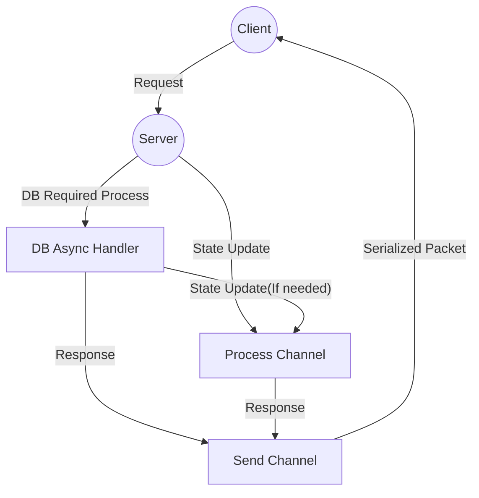
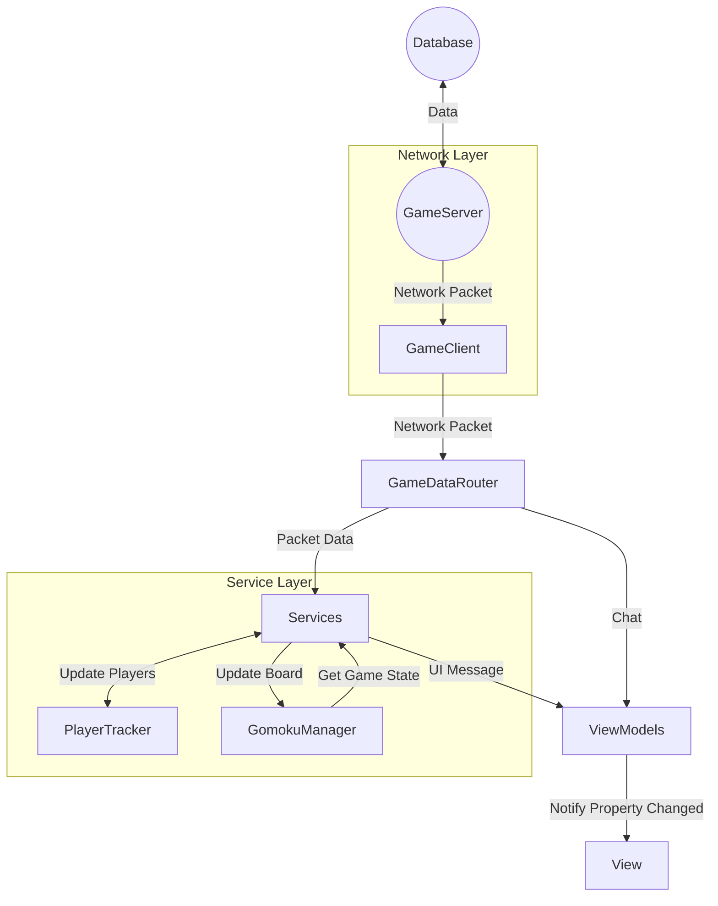

# 네트워크 통신 오목 게임

- Java -> C# WPF 마이그레이션
# MVVM 패턴 적용
MVVM 패턴 및 메시지 버스(IMessenger)를 활용한 메시지 기반 처리

## 주요 기능
### 랭킹

### 전적 보기

### 복기 모드

## 주요 레이어 및 역할

| 네트워크 레이어 | 역할 |
| :---- | :---- |
| NetworkSession | TCP 통신 및 직렬화/역직렬화 |
| GameClient | 서버에서 온 메시지 최초 처리 및 패킷 전송 처리 |

| 서버 | 역할 |
| :---- | :---- |
| GameServer | 클라이언트, DB와 통신, 게임 진행 및 결과 전송 |
| DatabaseService | 계정 정보, 전적, 대국 및 기보 저장/조회/삭제/업데이트 |

| 서비스 레이어 | 역할 |
| :---- | :---- |
| GameDataRouter | 클라이언트가 받은 패킷을 각 서비스에 전달, 서비스를 거치지 않아도 되는(채팅 등) 패킷은 메시지로 바꿔 뷰모델에 전송 |
| AuthSessionService | 세션 생명주기(연결, 인증, 종료) 처리 및 다른 플레이어 접속, 서버 자원 관리 |
| GameSessionService | 오목 게임 로직(턴 변경, 착수, 무르기, 게임 종료 등) 처리 및 게임 상태 동기화 |
| ServerCommandService | 서버 명령어(닉네임 변경 등) 처리 |
| ServerRequestService | 서버에 요청(랭킹, 전적 등) 처리 |

| 뷰모델, 모델 | 역할 |
| :---- | :---- |
| ViewModels | 서비스들로부터 받은 메시지로 UI 상태 변경 및 사용자 커맨드 전달 |
| Models | 오목 게임 진행, 룰 검증 및 순수 데이터 관리 |

## 연결 및 인증
 * 뷰모델이 AuthSessionService를 통해 연결 및 인증 요청
 * GameClient가 서버와 통신하여 인증 처리
 * 인증 완료 시 세션 초기화 및 플레이어 데이터, 참가자 데이터 등 동기화
 * 메시지를 통해 뷰모델로 전달되어 UI에 반영

## 게임 흐름
* 사용자의 행동은 각 서비스를 통해 비동기로 서버에 전달됨
* 서버의 응답은 각 서비스가 먼저 수신하여 모델을 먼저 업데이트 한 후, UI용 메시지로 재가공하여 뷰모델에 전달됨

## 세션 종료 및 자원 정리 흐름
* 연결 종료 감지 시 세션 및 서버 자원(서버 모드일시) 정리
* 각 서비스 연결 상태 종료
* 뷰모델에 알림 후 UI 반영

## 데이터베이스
* Users: 사용자 계정 정보(UserId, PasswordHash, Nickname 등)
* Matches: 대국 요약 정보(BlackPlayerId, WhitePlayerId, WinnerType, MatchTime 등)
  * 회원탈퇴 시 대국 정보의 PlayerId는 사전에 '탈퇴한 계정' 으로 등록했던 2로 설정
* MatchMoves: 대국의 상세 기보(MatchId 외래키 참조, MoveNumber, X, Y 등)
  * 제약조건: ON DELETE CASCADE를 적용하여 Matches에서 삭제 시 기보 데이터도 삭제되도록 설계
* UserRecord: (SQL VIew) 대국 요약 정보를 바탕으로 플레이어의 승,무,패를 계산

* 트랜젝션 처리: 경기 종료 시 승패 기록 업데이트(Matches)와 상세 기보 저장(MatchMoves)이 한 트랜잭션에 실행되도록 구현하여 시스템 오류 시에 데이터 불일치가 발생하지 않도록 방지
* 비밀번호: 클라이언트 쪽에서 salt 를 붙여 1차 해시(SHA256), 서버 쪽에서 2차 해시하여 비밀번호를 암호화된 상태로 저장함.

## 서버 아키텍처 설계
 * 게임 상태는 동시에 처리하면 충돌 위험이 존재하기 때문에 Channel 기반 단일 소비자 구조로 처리
 * DB 작업은 비동기로 병렬 처리
 * DB 처리 후 상태 변경이 필요한 경우 다시 Channel을 통해 동기적으로 처리
 * 응답 전송은 별도의 Send Channel로 순서대로 처리

  * 각 채널은 Single Consumer 구조로 순서대로 처리가 보장됨

## 수신 흐름도

 * 수신 흐름 시에 ViewModel은 서버의 로우 데이터(GameData)를 직접 받지 않음. Services 가 먼저 데이터를 수신하여 모델을 업데이트 한 후, UI에 최적화된 메시지를 정제하여 보냄
 * ViewModel은 오직 서비스의 인터페이스만 알고 있음. 송신 시에는 각 서비스 인터페이스의 비동기 메서드를 호출하여 추상화된 통신 수행
 * 요청 시 UI에 즉시 반영하지 않고 서버의 응답을 받고 반영함 (서버에서 검증 후 응답 발송)

## 주요 구현 포인트
 * MVVM 패턴 기반 메시지 버스(IMessenger) 구조 적용
 * 로직 서비스 분리 및 인터페이스화로 테스트 용이성 향상
 * Channel 기반 단일 소비자 서버 구조(송, 수신)로 동시성 제어
 * DB 트랜잭션 처리로 일관성 보장
 * 네트워크 예외 및 세션 종료 처리